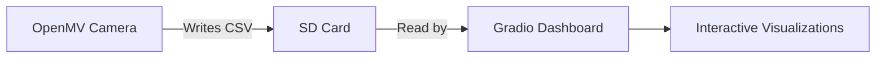

# OpenMV Drone Detection Dashboard


*A Gradio-based dashboard for visualizing drone detection data from OpenMV*

## 📌 Overview

This project provides a real-time monitoring system for drone detection using:
- **OpenMV Cam** for onboard object detection (FOMO model)
- **CSV logging** for persistent data storage
- **Interactive Gradio dashboard** for data visualization

## 🛠️ Features

- **Four interactive plots**:
  - Confidence scores over time
  - Position heatmap (OpenMV coordinate system)
  - Detection frequency timeline
  - Confidence distribution histogram
- **Dynamic filtering**:
  - Adjustable confidence threshold
  - Class-based filtering
- **Data management**:
  - CSV auto-reloading
  - Raw data inspection

## ⚙️ Hardware Requirements

- OpenMV Cam (H7 recommended)
- MicroSD card (for CSV storage)
- USB cable/Wi-Fi module (for data transfer)

## 🚀 Installation

1. ### Clone the repository:
   ```bash
   git clone https://github.com/rkarmaka98/drone_detection_edge.git
   cd drone_detection_edge
   ```
2. ### Architecture

3. ### Usage
* Run the OpenMV detection script
* Start the dashboard:
```bash
python dashboard.py
```
* Access the dashboard at http://localhost:7860
